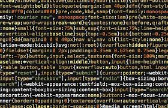

## First Impressions
  Some might find this surprising especially from a newbie programmer such as myself, but I personally don't have much issues with ESLint.
Not only do I understand the importance of coding standards, but after experiencing the hell that was CheckStyle in ICS 211, 
simple code formatting such as proper spacing and indentation sort of come naturally at this point. My only experience with IDEs prior to
IntelliJ was Eclipse, which I had used in ICS111 and ICS211, and I must say that it certainly seems a bit more complex than Eclipse, 
but at the same time it has many features that I certainly appreciate after coming from Eclipse. Though the complexity that I am experiencing
is probably due to the fact that I am just not familiar to the IDE, and that there are so many new tools for me to use that I don't know
how to use. 

## The Importance of Coding Standards
  Had you asked me my opinion on coding standards prior to ICS 211, or even the final project of ICS 111, I would have told you the 
complete opposite of what I had just said, however after having to work with a partner for ICS 111's final project and after 
learning that hell is actually yellow instead of red in ICS211, I learned the importance of consistency and neatness when it comes to
writing your code. You may ask, "What if you're working by yourself, why bother with coding standards if you're the only one who will
ever look at the code?". I believe that coding standards are just as important regardless if you're working with others or just by
yourself. Working with others is fairly straightforward, you keep your code neat to ensure that who you work with can also read your
code, but when working by yourself it's still important to keep your code neat because you want to make sure that if something goes 
wrong, or you want to improve on your code, you can much more easily see the errors that lie in your code. Even just adding comments
for your future self will help you understand what exactly was going through your brain during the time of writing whatever code it is
you wrote.

## Without Coding Standards, There is No Such Thing as "Good Code".
  I believe that coding standards is key to writing good code. I haven't seen any good code so far that wasn't organized in some
understandable and easy to look at fashion. Sure, code doesn't necessarily need to look nice to work, but we aren't perfect, and we're
bound to make mistakes. When those mistakes come, would you rather want to look at a block of jumbled up letters and numbers, or neat
and organized lines of code?
