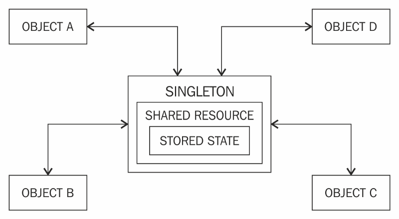

Author: Gunwook Baik

## What are design patterns?
  Design patterns are problems that pop up time and time again in the environment you work in, along with the solution to that problem 
that can be reused. The solutions, however, change according to the situation. A real life example of a design pattern could be 
something like the calculator. The problem that causes calculators to exist is that someone needs to do difficult or tedious 
calculations faster than they would by hand. But the solution changes based on the type of calculations needed to be done, and each 
solution has their pros and cons. You have graphing calculators for when the person needs to solve some calculus problems, scientific 
calculators for someone who need a simpler interface that the graphing calculator, and still solves things like logarithms, financial 
calculator for financial calculations that have to do with taxes and such, and many more.

They all solve the same problem: Needing to do complex calculations quicker than you would by hand. But the solution changes based on 
the situation.

## What design patterns have you used in your own code?
  Ever since I started coding in ICS 111, I never really noticed how much I have used design patterns, but after watching about them, I 
realized that I've been taught to use them and have used them unknowingly ever since. A couple design patterns that I have noticed that
I use in my own code would be the singleton and factory patterns. The Factory pattern allowed me to return objects that have to do with 
different classes. The Singleton pattern which ensures that a class has one instance and providing a global point of access to that 
instance. They are things that I do unconsciously and are things that I find to be common sense, but I never realized were actually 
called "design patterns".

