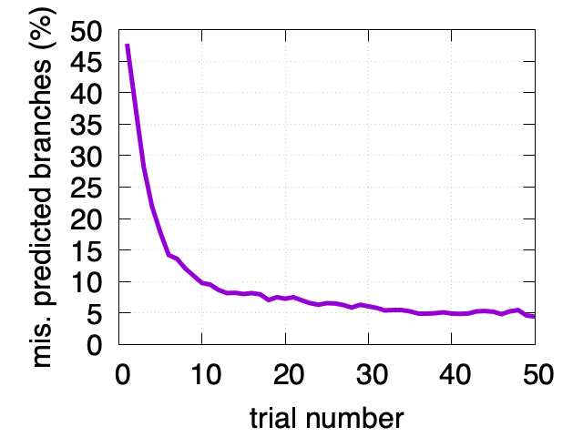

## Is There Such a Thing as a "Dumb Question"?
We're often told by our teachers in the past that "there are no such thing as a dumb question", but is that statement really true?
As a tutor myself I also find myself saying that to my students, but not necessarily because I genuinely believe there is no such thing as a 
dumb question, but because I need to ensure that my students are not holding back any doubts or misunderstandings they may have with the
content they are learning. There are millions of dumb questions asked and yet to be asked on Earth. You might ask, "well what IS a smart question?",
but the question itself isn't so much the cause of it being dumb, but the way it is presented. Simply asking for an answer to the problem
is what makes a question dumb, but asking "why" the answer is what it is opens up so much more room for explanation for the person 
explaining, and more room for understanding by the person asking the question. Asking what is "1 + 1" may very well be a dumb question, 
but asking why 1 + 1 equals to 2, and not another number like 3, or "window" goes into topics like the origin of the number 1, how we 
assigned the value of 1 to the symbol, and so on. There is more to be learned by playing the "why" game that we loved to play as kids.

## An Example of a Smart Question
An example of a smart question that I found on StackOverflow asked why it is that processing a sorted array is faster than an unsorted array.
It seems like a relatively simple question to ask, after all wouldn't it take longer for you to sort a messy stack of papers, or one that was
alphabetically sorted already? But the further we look into the issue, the more complex it really is. In the code provided we can see that
the code still goes through the same set of data, and that the number of checks the code must do is the same. Even if the data is sorted,
the computer must still run through the rest of the data, so what causes the 6 times discrepancy in the runtimes? 
The answer to this went into a seperate topic that is "branch prediction", and how applications have a built in "guessing" method 
that uses past data to guess what the next set of data will return. 

## Why Is This a Smart Question?
You'd think that computers/applications wouldn't try to "guess" anything, but by asking "why", we learned so much more than if the 
person asking had said "Which code runs faster?". Had they asked that question, the answer would have just been "The code with sorted data",
and the explanation would end there. The person asking the question would not have learned anything, and when encountering the problem again,
they wouldn't be able to choose accurately. They also avoided unnecessary filler in the questions, and made the question easier to answer
as a result. The question was clear and concise. They presented their problem, stated what they understood and what they didn't, and left it at that.

## How is this Important for Me?
This way of asking questions is very important for a software developer. Even though you can find many of the answers you encounter on the internet,
If you don't take away anything from the question, you'll just end up relying on the internet for all your answers, which is a colossal waste of time,
not only for yourself but for the people answering your question as well. What I learned from this was that asking questions is a natural thing to do,
however how you ask your question makes all the difference. You don't want to just get the answer, but also learn to understand why it is
you had the question in the first place to make sure you don't have to rely on people for that same question. 

[Link to mentioned smart question](https://stackoverflow.com/questions/11227809/why-is-processing-a-sorted-array-faster-than-processing-an-unsorted-array)
