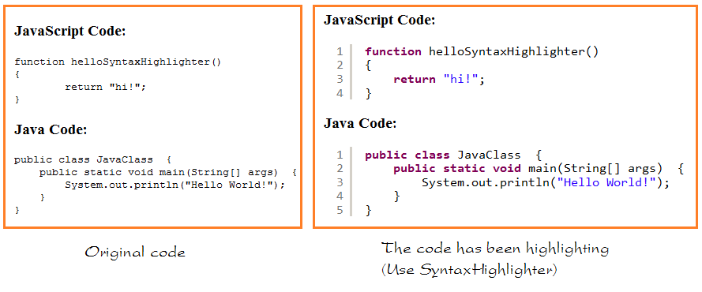

## My Experiences with JavaScript and its differences from Java
With only two college semesters of coding in Java under my belt I do not have as much experience as I’d like in reviewing a coding language I just learned, however so far the transition is not as bad as I thought it would be, albeit still annoying. It shares many similarities with Java, however there are many small things that have changed, so much to the point where I end up confused with what to do since I have only thought about code in terms of Java up until now. What makes Javascript so confusing is how simple it is. For example, Java requires you to declare each variable to a specific type (int, long, double, etc), however in JavaScript that is not required. Other small differences are like using “let” or “const”, two things that I do not believe are in Java, or I had no use of in ICS 111 or 211. The picture below is a good example of how simple/different JavaScript is from Java. Both sets of code are used to print out something in the console, however as you can see, you just have to write two words with Javascript

## Is JavaScript Better?
The simplicity that comes with JavaScript I feel would be great for fresh and new programmers, however I’m sure that this simplicity would result in it being less versatile than other more advanced languages like C when it comes to more complex goals. This leads to whether or not I believe JavaScript to be useful to me in the future, and I honestly do not think it will. I believe learning it is still very important as learning it will help me gain more experience with programming in general since I am still very new to all of this, but I can’t see myself using the language specifically in my career path. I hope to work as a game developer, and making more complex games is more suited for C++ or C# rather than JavaScript. I am currently in the process of developing a game with a few of my friends in ICS, and C# is a great programming language for the Unity Engine, something that is used very often in indie-type games for people who don’t work at large companies which have developed and spent a lot of money for their own engine, such as the Luminous Studio Engine that Square Enix uses for Final Fantasy XIV.

## Will I Find a Use for JavaScript?
Since I will be learning C and C++ in ICS 212 alongside JavaScript in ICS 314, I might have a difficult time with juggling three languages, but overall I believe I can get used to it with enough work and dedication. I do find learning this language to be stressful in some aspects, such as if I start doubting my code working, but in reality my code isn’t printing out because if forgot the console.log on the bottom of the code, but overall the simplicity of it is a nice refreshing experience I could definitely get used to, especially after burning out my brain from the ICS 211 homework assignments, like the Hexadecimal Sudoku Solver.
