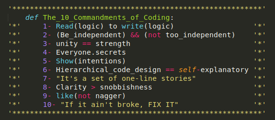

Author: Gunwook Baik

### My Adventure through Software Engineering

I made a ton of progress towards my career this past semester in ICS 314. Although I am interested in Video Game Development, taking
this class and learning about web design and using Javascript did help me in my endeavor. I've talked about my experience with 
Javascript in the past, and essentially what I said was that, although it isn't a relevant language used to create video games, the 
thought-processand logic learned through using it will definitely help me develop experience with coding. Web design using Semantic UI 
did help me also as it taught me how to use tools given to me, such as Underscore and CSS, to create whatever I may envision. Working on 
the Final Project with my group members Jake, Bryson, Sean, and Sheena also taught me a bit about what it is like to work with others. 
Although it may not have been on a scale as large as the companies I hope to work at with hundreds of people working on one project, it 
was a fantastic opportunity for me to understand the importance of the small things like Coding Standards and keeping good 
communication, especially since up until now, considering the ICS department has only had one form of teamwork in ICS 111's final 
project.

### How can UI Frameworks Help a Future Video Game Dev?

Just like how video games developers work with game engines such as Unreal Engine 4, which may contain things like assets for physics, 
graphics, and so on, we also had our own set of tools to work with in the form of Underscore and Semantic UI. Creating web pages using
solely HTML and CSS is fairly simple, but also looks the part as well. It definitely isn't something you would use in a professional
setting where you are trying to create an eye catching website, and the same goes for video game development. You wouldn't go ahead and
make your triple A game using solely Java, you'd just be too limited in what you can do. Using tools like Semantic UI which
supply you with a variety of visuals such as buttons, textboxes, and the likes allows you to be more imaginitive in what you want to
do with your website. Though it may not include the functionality of the buttons or other Semantic UI assets, it certainly does help 
with achieving the vision that you may have for your website at the start. Being able to effectively use the tools laid out for you
will certainly help you get the results you want in any field.

### Coding Standards and its Importance When Working With Others

Working with others is most likely a given when it comes to working as a Video Game Developer. Not only does creating a project all on
your own an immense task that many cannot handle, having others working with you gives you multiple perspectives on how an issue should
be tackled. This applied to what I did in this class when working with my teammates in designing our website, UH Water Fountains. It's a 
given that communication is important when working with others, and one form of that communication is making sure your code looks proper 
and has comments behind all of them. Issues are bound to happen to every group when working on a project, making sure you code
is neat and readable really helps with troubleshooting as it can help you spot problems in the code quickly. This happened a few times
while working on our website, where just having a word in its plural form caused our code to break. Sometimes we caught it early before
it caused problems, but other times it took us hours trying to find similar problems. Using proper Coding Standards will help you 
figure out the logic behind any code and quickly find issues in the code.

Even though I may not use these skills in the context of Web Design in my career, my journey to become a video game developer will 
undoubtedly benefit from what I learned in this class. 
