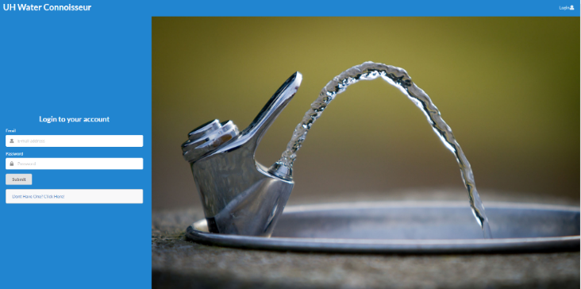

Working with my classmates Bryson Yuen, Sean Sumida, Jake Castillo, and Sheena Torres, we created a website dedicated to giving students 
a place where they can look up the assortment of water fountains located on the University of Hawaii Manoa campus. The idea came 
originally from Bryson Yuen and Sean Sumida and the website's goal was to essentially create a site where users can visit, see where
fountains are located on the campus, and review each fountain they may go to with up to a 5-star rating. It would also allow users to
submit their own water fountains if it was not listed in the system, where any admins could go in and approve of or delete any submissions
that may be troll posts. 

Some of the things I was responsible for in the project was to create the log in page, going to the University to collect real data and 
pictures of fountains, and helping out group members Jake Castillo, Bryson Yuen, and Sean Sumida with the ratings system
and how the list of fountains look under each building, as seen in the surrounding pictures.

[Link to the project page and source code](https://uh-waterfountain.github.io/)
